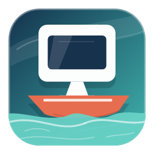

# DeskFerry

DeskFerry is an outbound-only RDP, WinRM, SMB, and authenticated screen-view rendezvous tunnel for a work PC that cannot accept inbound connections. The current architecture uses an Azure App Service relay at `https://test-officialwebsite.azurewebsites.net/relay/` and an OCI Always Free fallback relay at `http://217.142.228.117/relay/`. The Azure relay implementation is .NET, the OCI relay implementation is a lightweight Go service, and a protocol-compatible Python/FastAPI relay is also available under `relay/python/`. The work-side Windows service and the Windows, macOS, and Android home agents prefer outbound WebSockets and transparently use paired acknowledged HTTP `POST`/`GET` streams when a proxy rejects WebSocket setup.

On Windows, one `DeskFerry.exe` provides the control panel, Home client, optional Work service, optional SMB network service, component management, and screen-capture helper. Each Home destination profile contains a room, ordered relay service base URLs, and its proxy selection. The first service is primary; later services are fallbacks. DeskFerry appends the profile room to each base URL at runtime, and existing full room-URL settings migrate automatically. New Home profiles are pre-filled with these two known relay services:

```text
https://test-officialwebsite.azurewebsites.net/relay
http://217.142.228.117/relay
```

For example, room `workdesk` produces the compatible runtime URLs `https://test-officialwebsite.azurewebsites.net/relay/workdesk` and `http://217.142.228.117/relay/workdesk`. The first work agent to use a room creates it in memory on that relay. Rooms may be left unprotected or protected with a password configured on the work agent; protected home clients must supply the same password.

The Android app is a home-agent client like the Windows and macOS home agents. It is not a phone-hosted relay service.

## Table Of Contents

- [Release Notes](CHANGELOG.md)
- [How It Works](#how-it-works)
- [Installation](#installation)
  - [1. Deploy Azure Relay](#1-deploy-azure-relay)
  - [2. Deploy Go Relay On OCI](#2-deploy-go-relay-on-oci)
  - [3. Choose Relay Services And A Room](#3-choose-relay-services-and-a-room)
  - [4. Install And Configure Windows](#4-install-and-configure-windows)
  - [5. Run macOS Home Agent](#5-run-macos-home-agent)
  - [6. Run Android Home App](#6-run-android-home-app)
- [Deliverables](#deliverables)
  - [Azure Relay Web Service](#azure-relay-web-service)
  - [Go Relay Web Service](#go-relay-web-service)
  - [Python Relay Web Service](#python-relay-web-service)
  - [Merged Windows App](#merged-windows-app)
  - [macOS Home Agent](#macos-home-agent)
  - [Android Home App](#android-home-app)
- [Security Model](#security-model)
- [Build Prerequisites](#build-prerequisites)
- [Build Commands](#build-commands)
- [URL Configuration](#url-configuration)
- [Troubleshooting](#troubleshooting)
  - [Diagnostic Logs](#diagnostic-logs)
  - [Repeated RDP Disconnects After A Network Drop](#repeated-rdp-disconnects-after-a-network-drop)
  - [Agent Self-Test Fails Through Proxy](#agent-self-test-fails-through-proxy)
  - [Endpoint Protection Flags Windows Binaries](#endpoint-protection-flags-windows-binaries)
  - [Home App Connects But RDP Fails](#home-app-connects-but-rdp-fails)
  - [Work File Access Fails](#work-file-access-fails)
  - [OCI Relay Becomes Unresponsive](#oci-relay-becomes-unresponsive)
  - [Saved Windows Login](#saved-windows-login)
  - [Azure Relay Status](#azure-relay-status)
- [Development](#development)
- [Repository Layout](#repository-layout)
- [Status](#status)
- [Current Limitations](#current-limitations)

## How It Works

```text
Home PC, Mac, or Android device
  RDP client -> 127.0.0.1:<home agent port>
        |
        v
DeskFerry home agent
  Windows GUI, macOS control panel/CLI, or Android foreground service
  outbound WebSocket, or paired HTTP POST/GET streams
        |
        v
Relay web service
  Azure: https://test-officialwebsite.azurewebsites.net/relay/workdesk
  OCI:   http://217.142.228.117/relay/workdesk
        |
        v
DeskFerry.exe Work service mode
  outbound WebSocket or paired HTTP-stream connections to one or more relay services
  optionally through an HTTP or HTTPS proxy
  RDP sockets   -> 127.0.0.1:3389
  WinRM sockets -> 127.0.0.1:5985 (when enabled)
  SMB sockets   -> 127.0.0.1:445 (when enabled)
```

The relay groups connections by room name and service type. Each work agent keeps one lightweight `agent-control` connection per configured relay. Native WebSocket is preferred. If the configured proxy rejects the WebSocket tunnel or upgrade, current clients transparently use a streaming `POST` for upstream messages plus a streaming `GET` for downstream messages. After authenticating a Home `client` request, the relay sends a short-lived session offer over that control channel; an accepted offer creates a separate outbound `agent-session` data connection that is paired with the Home socket. The relay stores only an in-memory room-scoped password proof, never the room password or Windows login credentials.

On Windows Home PCs, the optional `DeskFerryHomeNetwork` service creates a Wintun Layer-3 adapter for the synthetic `198.18.0.0/30` network. The merged component manager maps `deskferry-work` to `198.18.0.2`; tun2socks sends that adapter's TCP stream to a DeskFerry-owned loopback SOCKS endpoint, which accepts only the synthetic address on TCP port 445. The work agent then connects to the work PC's existing loopback SMB server. Normal Internet and LAN routes are not changed.

Current agents negotiate resumable RDP streams with the relay. If an HTTP proxy or network path drops an active WebSocket or one half of the HTTP fallback, both endpoints keep their local RDP sockets open, reconnect, and replay only messages and bytes that the peer has not acknowledged. Each transport layer buffers at most 8 MiB of unacknowledged data so an extended outage applies backpressure instead of consuming unbounded memory. Negotiated end-to-end heartbeat frames also detect a path that remains connected at the TCP layer but stops forwarding application data; peers probe after five seconds and replace a transport that does not respond within another 15 seconds. Older agents and relays continue to use the original non-resumable stream protocol.

Resumption is enabled only when both paired endpoints send `X-DeskFerry-Resumable: 1`. Heartbeats are enabled only when the Home client requests `X-DeskFerry-Heartbeat: 1`, the Work agent confirms the `heartbeat` capability in its offer response, and the relay returns it in both typed `session-ready` results. This negotiation prevents new heartbeat frames from reaching an older peer during a rolling upgrade. Protocol v2 returns the random session ID in a typed `session-ready` result; legacy pairs use `start <session-id>`. Following an abnormal transport close or a heartbeat timeout, each endpoint reconnects with the `resume` role, the session ID, and its `agent` or `client` side. Normal closure, explicit completion, and authentication rejection are terminal and never enter the resume loop. If a relay process restarts and loses its in-memory rendezvous record, it reconstructs the session after both endpoints present the same random session ID, service, opposite sides, and valid room proof; stream offsets and replay data remain endpoint-owned and do not need relay persistence.

The home app also keeps a lightweight `home-agent` presence connection open while it is running, using the same WebSocket-first transport selection. That presence connection lets the relay dashboard and home control panels show whether the home side is online; RDP data still flows only when a home agent starts a local listener and an RDP client connects to it.

The Android home app follows the same model. It runs a foreground service, listens on Android loopback, and lets a separate Android RDP client connect to `127.0.0.1:<port>` on the phone. The phone is not a relay and does not need inbound access from the internet.

## Installation

### 1. Deploy Azure Relay

Build the deployable zip:

```powershell
.\build\build-azure-relay.ps1
```

Deploy `dist\azure-relay\deskferry-azure-relay.zip` to the Azure App Service with Azure CLI:

```powershell
az webapp deploy --resource-group OfficialWebsite --name test-officialWebSite --src-path .\dist\azure-relay\deskferry-azure-relay.zip --type zip --clean true --restart true --track-status true
```

The authenticated Kudu Zip Deploy page is the fallback when Azure CLI is unavailable. Confirm WebSockets are enabled in App Service configuration. On App Service, the relay writes directly to `%HOME%\LogFiles\Application\deskferry-relay-<instance>-<pid>.log`; this avoids depending on ANCM stdout capture.

Dashboard and health endpoints:

```text
https://test-officialwebsite.azurewebsites.net/relay/
https://test-officialwebsite.azurewebsites.net/relay/<room>
https://test-officialwebsite.azurewebsites.net/relay/health
https://test-officialwebsite.azurewebsites.net/relay/status
```

### 2. Deploy Go Relay On OCI

The OCI fallback relay runs as a small native Go binary. The current OCI deployment is:

```text
http://217.142.228.117/relay/b
```

It runs as the systemd service `deskferry-relay.service` under `/opt/deskferry/go-relay` and listens on public HTTP port `80`. The OCI security rules must allow inbound TCP `80`, and the VM firewall must allow the `http` service.

The OCI relay does not terminate TLS. Use `http://217.142.228.117/relay/<room>`, not `https://217.142.228.117/relay/<room>`. The `https://` form makes clients try port `443`, which is not served by this VM.

Build the native Linux relay binary:

```powershell
.\build\build-go.ps1
```

On Windows hosts where endpoint protection falsely classifies stripped Go PE files, build the Windows deliverables with symbols and compiler optimizations disabled:

```powershell
.\build\build-go.ps1 -DebugWindows
```

Artifact:

```text
dist\bin\deskferry-relay-linux-amd64
```

SSH egress from the work network must go through the HTTPS proxy. Direct `ssh` and `scp` to OCI are expected to time out. Use Ncat as OpenSSH's HTTP `CONNECT` transport:

```powershell
$ociKeyPath = "$env:USERPROFILE\Downloads\ssh-key-2026-06-27.key"
$ociProxyCommand = 'ncat --proxy 192.9.200.25:3128 --proxy-type http %h %p'
ssh -i $ociKeyPath -o IdentitiesOnly=yes -o "ProxyCommand=$ociProxyCommand" opc@217.142.228.117 'hostname'
```

Deploy through a temporary upload, replace the installed binary, restart the service, and remove the upload so old or staging binaries are not retained:

```powershell
scp -i $ociKeyPath -o IdentitiesOnly=yes -o "ProxyCommand=$ociProxyCommand" dist/bin/deskferry-relay-linux-amd64 opc@217.142.228.117:/tmp/deskferry-relay-linux-amd64
ssh -i $ociKeyPath -o IdentitiesOnly=yes -o "ProxyCommand=$ociProxyCommand" opc@217.142.228.117 'sudo install -m 0755 /tmp/deskferry-relay-linux-amd64 /opt/deskferry/go-relay/deskferry-relay && sudo systemctl restart deskferry-relay.service && sudo rm -f /tmp/deskferry-relay-linux-amd64'
```

Keep the proxy command on every OCI SSH/SCP operation from this network; the proxied health check alone does not imply that direct SSH is available.

The current OCI host is hardened for a small Always Free VM: it uses a 2 GiB swap file, persistent journald, a five-minute systemd runtime watchdog through `softdog`, kernel panic recovery for hung tasks, and a local health timer named `deskferry-relay-healthcheck.timer`. The longer watchdog window avoids resetting a resource-constrained VM during short hypervisor stalls while still recovering sustained hangs. The timer checks `http://127.0.0.1/relay/health` every minute, restarts `deskferry-relay.service` when the relay process stops responding, and reboots the VM after three consecutive failed post-restart checks.

### 3. Choose Relay Services And A Room

Keep both pre-filled relay service base URLs unless one is intentionally unavailable:

```text
https://test-officialwebsite.azurewebsites.net/relay
http://217.142.228.117/relay
```

Pick a room name that is easy for you to remember but not obvious to outsiders, such as `workdesk`. A Home destination must match the room configured by the Work service on the PC it connects to. A PC's own Work room is independent from the Home destination it uses to connect elsewhere, so this host can publish room `b` while its Home profile connects to room `h`. Keep the `http://` scheme for the OCI service. If a home or work log shows `https://217.142.228.117/...`, that client is trying port `443` and will fail before it reaches the relay.

The work agent uses both services at the same time. Home apps treat the first row as primary and later rows as fallbacks.

### 4. Install And Configure Windows

Build or download the self-contained Windows executable:

```text
dist\bin\deskferry-windows-amd64.exe
```

Launch it normally. The main control panel owns Home connection settings, including the optional SMB/UNC bridge, and can run as a portable Home client without elevation. Open **Work Services** only when this PC itself should be published through DeskFerry; the Work service is optional. There is no separate Windows Components window.

The application checks Windows Service Manager before presenting actions:

- A missing service offers **Install**.
- A stopped service offers **Start**.
- A running service offers **Stop**, **Configure**, and **Remove**.
- A legacy service path offers **Migrate / Update**.
- An incomplete installation offers **Repair**.

The same executable is registered as the automatic `DeskFerryAgent` Work service and, when file access is enabled, as the `DeskFerryHomeNetwork` service. WinRM, Work-side SMB, and authenticated screenshots are optional modules of `DeskFerryAgent`; they are not separate persistent executables. Screenshot capture launches an interactive helper from the same binary only while a user has explicitly shared the screen.

Home connection profiles are edited in the main control panel. Work Services has its own editable room and proxy because a PC can connect Home to one room while publishing itself on another. Relay service bases are intentionally not shown in the Work Services window: an existing service's bases are preserved internally, while a new service uses the known Azure and OCI bases. Leave **Install Work services on this PC** unchecked to use DeskFerry only as a Home client. Existing `DeskFerryAgent` settings and the machine-scope DPAPI room password are preserved during migration.

The Work Services Activity pane shows the recent `work-agent-*.log` tail and follows new relay and service-session events while the window is open. The log remains available under `%ProgramData%\DeskFerry` for longer diagnostics.

To enable remote command execution, enable **WinRM** and normally use target `127.0.0.1:5985`. Windows Remote Management must already have a local listener, and a non-empty room password is required.

To enable Windows file sharing on the Work PC, enable **SMB**, normally use target `127.0.0.1:445`, and keep alias `deskferry-work`. DeskFerry registers only that alias; it does not create shares or weaken their NTFS or share permissions. On the Home PC, the selected Home profile supplies the matching SMB alias and room settings to the optional Wintun/tun2socks bridge.

For screenshots and delta streaming, select **Allow authenticated screenshots and delta streaming**. This requires a room password and remains disabled until explicitly selected.

The merged executable retains CLI modes for administration:

```powershell
# Work service
Read-Host "Room password" -MaskInput | .\DeskFerry.exe -work-configurator `
  -cli-action install `
  -room workdesk `
  -relay-base-url https://test-officialwebsite.azurewebsites.net/relay `
  -relay-base-url http://217.142.228.117/relay `
  -proxy env `
  -room-password-stdin `
  -winrm 127.0.0.1:5985 `
  -smb 127.0.0.1:445 `
  -smb-alias deskferry-work

.\DeskFerry.exe -work-configurator -cli-action status
.\DeskFerry.exe -status
.\DeskFerry.exe -self-test -relay-url https://test-officialwebsite.azurewebsites.net/relay/workdesk

# Optional Home SMB bridge administration (non-visual backend)
.\DeskFerry.exe -windows-setup -cli-action install
.\DeskFerry.exe -windows-setup -cli-action status
```

Room passwords are passed over standard input or a consumed DPAPI-protected request file, never on a command line. Work stores the password with machine-scope DPAPI; Home profiles store only the derived room proof. Saved Windows RDP, WinRM, and SMB logins remain in Windows Credential Manager.

Relay connections use standard proxy environment variables by default. A profile can instead select `direct` or an explicit `http://` or `https://` proxy URL. On Windows, NTLM proxy authentication uses the current Windows identity; LocalSystem service modes temporarily use a logged-on interactive user's identity so the proxy receives the employee account rather than the machine account. Native WebSocket is preferred and paired acknowledged `POST`/`GET` streams are used when the proxy rejects the upgrade. Learned HTTP-stream and CONNECT capabilities are persisted so later connections avoid probes already proven unsupported.

The Windows control panel normally listens on `127.0.0.1:3390` for RDP and `127.0.0.1:3391` for WinRM. **Connect** starts the selected Home profile and can open Remote Desktop. **Screen Viewer** is independent of the RDP tunnel. Each destination stores its Windows username and optional Credential Manager login for RDP, WinRM, and SMB.

### 5. Run macOS Home Agent

Choose the binary for your Mac:

```sh
chmod +x ./deskferry-home-macos-arm64
./deskferry-home-macos-arm64 -relay-url https://test-officialwebsite.azurewebsites.net/relay/workdesk -room-password 'strong password' -open-rdp
./deskferry-home-macos-arm64 -room workdesk -relay-base-url https://test-officialwebsite.azurewebsites.net/relay -relay-base-url http://217.142.228.117/relay -open-rdp
```

Use `deskferry-home-macos-amd64` on Intel Macs. Normal launch opens a local profile-oriented control panel and runs the Home agent in the foreground. It manages named destinations, ordered relay service base URLs, room credentials, the local RDP listener, relay status, and the same screen-view workflow as Windows. The viewer opens in a separate window with capture, delta stream intervals, stop, fullscreen, and PNG download controls. Use `-ui=false` for the legacy command-line workflow. The listener defaults to `127.0.0.1:3389`, and `-open-rdp` opens an `.rdp` profile. If your RDP app does not open automatically, connect it manually to:

```text
127.0.0.1:3389
```

The macOS executable supports the same non-UI screenshot commands and saved destination selection; screenshot commands imply CLI mode, so `-ui=false` is not required:

```bash
./deskferry-home-macos-arm64 -destination 'Room b' -screenshot "$HOME/Pictures/Room-b.png"
./deskferry-home-macos-arm64 -destination 'Room b' -screenshot-stream "$HOME/Pictures/Room-b-stream" -screen-interval 500ms -screen-count 20
```

The macOS agent has the same persistent daily diagnostics and `-log-retention-days <days>` option as the Windows home agent. Logs are stored in the user's DeskFerry configuration directory, normally `~/Library/Application Support/DeskFerry`.

### 6. Run Android Home App

Install the debug-signed APK:

```text
dist\android\deskferry-home-android-debug.apk
```

Release APKs from 0.9.4 onward use a stable DeskFerry signing identity and can upgrade one another in place. Releases through 0.9.3 used unrecoverable per-run CI debug keys, so installing 0.9.4 over one of those versions requires one final uninstall; that uninstall clears Android app data.

Open DeskFerry Home, keep the local RDP port at `3389`, and choose or create a named destination. Each destination stores a room name, the same ordered relay service base URLs as its work agent, and an optional room credential. Enter the same room password before starting a protected destination. Stop the tunnel before changing destinations. In an Android RDP client, connect to:

```text
127.0.0.1:3389
```

For SMB file access, keep **Local SMB port for CX File Explorer** at the non-root default `1445`, start the tunnel, and add an SMB location in CX File Explorer using host `127.0.0.1`, port `1445`, the Work share name, and the Windows account that can access that share. The selected profile must have a saved room password and the Work agent must enable its SMB target, normally `127.0.0.1:445`. Android is only forwarding loopback TCP to that Work SMB service; it is not hosting shares on the phone.

The Android app keeps the tunnel alive through a foreground service while you switch to the RDP client. It maintains the same `home-agent` presence connection used by the relay dashboard and a `dashboard` connection for live relay status updates. Its Proxy field accepts `system`, `direct`, `http://host:port`, or `https://host:port`; optional Basic credentials can be included in the proxy URL. Android uses the same paired HTTP-stream fallback when its proxy rejects WebSocket setup.

The Android **Screen Viewer** is independent of the RDP tunnel. It receives the same primary-display capture as Windows and macOS, Auto Fits it to the available image area, and provides one-shot capture, 0.5/1/2/5-second tile-delta streams, stop, immersive fullscreen, manual zoom/pan, and PNG saving under `Pictures/DeskFerry`. A saved room password and Work-side screen-view opt-in are required.

The foreground service observes Android's active network. A Wi-Fi/mobile handoff immediately replaces the relay transports so a resumable RDP stream can reattach before the separate RDP client times out its loopback socket. Resume handshakes use bounded attempts within the five-minute logical-session window; a dead mobile path therefore cannot consume the whole window, and a network-change notification wakes an attempt that is still waiting on the obsolete path. At most two local RDP bridge sockets run concurrently; additional reconnect/probe sockets wait locally instead of consuming every Work-agent session slot.

Android writes the same daily diagnostics to the app-specific external-files `logs` directory, falling back to internal app storage when necessary. Set **Diagnostic log retention days** in the control panel; the default is 7 and the accepted range is 1 through 3650. The activity log prints the resolved diagnostic-log path when the foreground service starts.

## Deliverables

### Azure Relay Web Service

`relay/azure-dotnet/` is a .NET 8 minimal ASP.NET Core service. It exposes:

- `GET /relay/` for the live overview dashboard.
- `GET /relay/{room}` for a room-scoped live dashboard.
- `GET /relay/health` for machine-readable health.
- `GET /relay/status` for JSON status.
- `GET /relay/ws` and `GET /relay/{room}/ws` as WebSocket endpoints.
- `POST /relay[/<room>]/stream/<id>/up` and `GET /relay[/<room>]/stream/<id>/down` as the acknowledged non-CONNECT fallback.

Relay clients identify their role with the same headers on either transport:

```text
X-DeskFerry-Role: agent-control | agent-session | client | resume | agent | home-agent | probe | dashboard
```

Relays also accept the former `X-TunnelDesktop-Role` header during the rename transition.

Roles:

- `agent-control`: persistent work-side offer channel; it never carries tunnel payload.
- `agent-session`: work-side data socket for one accepted v2 session.
- `client`: home-side data socket and v2 session request for RDP, WinRM, SMB, or authenticated screen viewing.
- `resume`: reattaches one side of a genuinely interrupted active session.
- `agent`: legacy rollback-mode work-side idle socket.
- `home-agent`: Windows, macOS, or Android home-agent status presence.
- `probe`: self-test connection.
- `dashboard`: browser status stream.

The dashboard shows work-agent presence, home-side activity, active stream counts, total stream count, and recent remote addresses. Home-side activity is active when either the lightweight home-app presence socket is connected or an RDP stream is currently bridged. It also serves the DeskFerry icon as `/relay/icon.svg` for favicon and header branding.

### Go Relay Web Service

`relay/go/` is a lightweight Go implementation of the same relay contract. It is the active OCI Always Free VM deployment because it runs as one static binary with a much smaller memory footprint than the Python/FastAPI relay.

It exposes the same user-facing paths:

- `GET /relay/` and `GET /relay/<room>` for the live dashboard.
- `GET /relay/health` for health JSON.
- `GET /relay/status` for JSON status.
- `GET /relay/ws` and `GET /relay/<room>/ws` as WebSocket endpoints.
- `POST /relay[/<room>]/stream/<id>/up` and `GET /relay[/<room>]/stream/<id>/down` as the acknowledged non-CONNECT fallback.

Build the Linux relay binary:

```powershell
.\build\build-go.ps1
```

The build emits:

```text
dist\bin\deskferry-relay-linux-amd64
```

### Python Relay Web Service

`relay/python/` is a FastAPI/ASGI implementation of the same relay contract. It is useful for hosting on Python-capable App Service plans or for local relay testing without the .NET runtime. The active OCI VM deployment uses the Go relay instead.

It exposes the same user-facing paths:

- `GET /relay/` and `GET /relay/<room>` for the live dashboard.
- `GET /relay/health` for health JSON.
- `GET /relay/status` for JSON status.
- `GET /relay/ws` and `GET /relay/<room>/ws` as WebSocket endpoints.
- `POST /relay[/<room>]/stream/<id>/up` and `GET /relay[/<room>]/stream/<id>/down` as the acknowledged non-CONNECT fallback.

Run it locally:

```powershell
python -m pip install -r relay\python\requirements.txt
python -m uvicorn app:app --app-dir relay\python --host 127.0.0.1 --port 8000
```

Build the deployable Python zip:

```powershell
python -m pip install -r relay\python\requirements-dev.txt
.\build\build-python-relay.ps1
```

The build emits both the source-style zip and an Oracle Linux 9 / Python 3.9 vendored zip for minimal VM deployments.

### Merged Windows App

`windows/` builds the single self-contained `DeskFerry.exe` Windows deliverable.

Normal launch provides:

- A control-panel and notification-area Home client.
- Named connection profiles with a room, ordered relay service bases, and per-profile proxy.
- Destination CRUD and relay URL CRUD/reordering.
- Local RDP and WinRM listeners.
- Windows Credential Manager integration for RDP, WinRM, and SMB.
- Relay presence, room status, activity with effective proxy/transport reporting, and screen viewing.
- An optional **Work Services** window; Home settings remain in the main control panel.

The same executable also provides:

- `DeskFerryAgent`, an automatic Work service mode supporting RDP, optional WinRM, optional SMB, and optional authenticated screenshots.
- `DeskFerryHomeNetwork`, an optional LocalSystem service mode owning the restricted Wintun/tun2socks TCP/445 bridge.
- An on-demand interactive screen-capture helper.
- Elevated self-install, migration, repair, configuration, and removal modes.
- GUI and CLI service management that checks SCM state and offers **Install** only when the service does not exist.

Existing Home JSON profiles are preserved. The optional Work service keeps an independent editable room and proxy, preserves its installed relay bases internally, and can be omitted entirely. Applying Work configuration migrates the machine-scope DPAPI room password and changes the service executable path to the installed `DeskFerry.exe`.

The self-contained artifact carries checksum-verified Wintun 0.14.1 and tun2socks 2.6.0 payloads. They are extracted only when the optional Home SMB bridge is enabled.

### macOS Home Agent

`home-agent/macos/` is the macOS home-side control-panel and command-line agent. It provides:

- A profile-oriented local control panel with the same room, ordered relay-base, connection, status, and screen-view workflows as Windows.
- A foreground local RDP listener, normally `127.0.0.1:3389`.
- One outbound WebSocket-first `client` transport per local RDP connection.
- A persistent WebSocket-first `home-agent` presence transport while it runs.
- A room name plus primary/fallback relay service base URLs for presence, status, and RDP stream connections.
- `-status` for relay room status.
- `-open-rdp` to write and open a local `.rdp` profile with the configured loopback target.
- `-ui=false` to retain foreground command-line-only operation.
- A separate screenshot/delta-stream viewer with interval, stop, fullscreen, and PNG-download controls.

### Android Home App

`home-agent/android/` is the Android home endpoint. It is not an RDP client by itself; it provides the loopback tunnel that an Android RDP client uses.

It provides:

- A native Android control panel with a room field, inline-editable relay service base URL rows, local RDP port, status tiles, activity log, copy, dashboard, and RDP launch actions.
- A foreground service so the tunnel can keep running while another app is active.
- A loopback RDP listener, normally `127.0.0.1:3389`.
- A password-gated loopback SMB forward, normally `127.0.0.1:1445`, for Android file managers such as CX File Explorer that accept a custom SMB port.
- One outbound WebSocket-first `client` transport per local RDP connection.
- A persistent WebSocket-first `home-agent` presence transport while the service is running.
- A persistent `dashboard` WebSocket for real-time work-agent and stream status.
- Named work-destination profiles, each with its own room and primary/fallback relay service base URL list for presence, status, and RDP stream connections.
- Destination add, rename, delete, and selection controls, plus relay base URL add, inline edit, delete, button reorder, and drag reorder controls.
- A native screen-viewer activity with one-shot screenshots, selectable tile-delta stream intervals, immersive fullscreen, and PNG saving.

Good free Android RDP client options include Microsoft's Remote Desktop/Windows App client and the open-source FreeRDP-based aFreeRDP client. Configure the RDP client to connect to the DeskFerry local target shown in the Android app.

## Security Model

- Work and home endpoints make outbound relay connections only. Native WebSocket is preferred; paired HTTP `POST`/`GET` streams are the fallback. Use HTTPS/WSS whenever the relay and proxy path support it.
- The room name is the pairing key for an unprotected room. Protected rooms additionally require the room-scoped password proof set by the work agent.
- Room passwords are not placed in URLs, service command lines, relay logs, or relay status. Work Services stores the password as a machine-scope DPAPI blob; home profiles store only the derived proof.
- A room proof is a bearer credential. Use a strong, unique room password and prefer `https://` relays. The plain-HTTP OCI fallback cannot protect a captured proof from interception and replay.
- The relay never dials the work PC or home PC.
- The work agent only dials its configured RDP, WinRM, or SMB loopback target after a relay has paired an authenticated, same-room, same-service home connection. Screen capture is separate, password-required, opt-in, and visibly launches in the active user session.
- WinRM is disabled unless Work Services has both a room password and a WinRM target. Windows login credentials are supplied by the home user for each command and are not handled by the relay.
- SMB is disabled unless Work Services has both a room password and an SMB target. The Home SOCKS bridge rejects every destination except the configured synthetic work address on TCP port 445; it is not a general-purpose VPN or proxy.
- SMB authentication and authorization remain Windows responsibilities. The Home app registers the selected destination's shared Windows login for the installed SMB alias in Windows Credential Manager; DeskFerry never places it in JSON or sends it through the relay, and it does not bypass share or NTFS permissions.
- Home apps listen on loopback by default, so other LAN devices cannot connect to local RDP or WinRM listeners unless the user intentionally changes a listen address.

Choose room names that are not obvious. For meaningful access control, also configure a strong room password and use TLS.

This software can route around corporate egress controls to expose an internal RDP session. Confirm that use is permitted by workplace policy. This project intentionally does not add anti-monitoring, stealth, or obfuscation behavior.

## Build Prerequisites

Required:

- Go 1.25+.
- .NET SDK 8+ for the Azure relay.
- Python 3.11+ for the Python relay.
- JDK 17+ plus Android SDK platform/build-tools 35 for Android.
- Gradle 9.x for Android.
- `rsrc` for the Windows manifest and icon; the build installs it under `D:\Go\bin` when missing.

The merged Windows build downloads [Wintun 0.14.1](https://www.wintun.net/) and [tun2socks 2.6.0](https://github.com/xjasonlyu/tun2socks/releases/tag/v2.6.0), verifies pinned SHA-256 hashes, and appends the runtime files and licenses to the Windows executable as a ZIP payload.

## Build Commands

Build and test Go targets:

```powershell
.\build\build-go.ps1
```

Create the self-contained merged Windows executable:

```powershell
.\build\build-windows.ps1 -SkipGoBuild
```

On PCs where endpoint protection rejects optimized unsigned Go PE files, produce the separately named debug artifact:

```powershell
.\build\build-go.ps1 -DebugWindows -DebugArtifactSuffix
.\build\build-windows.ps1 -DebugWindows -DebugArtifactSuffix -SkipGoBuild
```

Build other deliverables:

```powershell
.\build\build-azure-relay.ps1
.\build\build-python-relay.ps1
.\build\build-android-home.ps1
```

Artifacts:

```text
dist\bin\deskferry-windows-amd64.exe
dist\bin\deskferry-windows-amd64-debug.exe
dist\bin\deskferry-home-macos-arm64
dist\bin\deskferry-home-macos-amd64
dist\bin\deskferry-relay-linux-amd64
dist\azure-relay\deskferry-azure-relay.zip
dist\python-relay\deskferry-python-relay.zip
dist\python-relay\deskferry-python-relay-linux-cp39-vendored.zip
dist\android\deskferry-home-android-debug.apk
```

## URL Configuration

Use one shared room name:

```text
https://test-officialwebsite.azurewebsites.net/relay/<room>
```

OCI Go relay example:

```text
http://217.142.228.117/relay/<room>
```

Rules:

- `<room>` is created automatically on first use.
- Reusing the same URL joins the same room.
- Work and Home profiles accept one `<room>` plus multiple relay service base URLs; agents compose the full room URLs internally.
- Full room URLs remain accepted by legacy CLI flags. Graphical apps treat the first relay service row as primary and later rows as fallbacks.
- Relays accept work-agent identity headers and keep only the latest control connection per room and agent identity. Legacy instance/slot deduplication remains available during rollout.
- The WebSocket endpoint is derived automatically as `/relay/<room>/ws`.
- The base `/relay/` path is an overview dashboard.
- No generated pairing files are required for the normal Azure WebSocket path.

## Troubleshooting

### Diagnostic Logs

DeskFerry records connection lifecycle details intended to make intermittent disconnects traceable across the home agent, work agent, and relay. Entries include relay selection and dialing, proxy use, selected WebSocket or HTTP-stream transport, connection and close information, pairing identifiers, stream direction, byte and message counts, elapsed time, socket state, cancellation state, and errors. Credentials, proxy passwords, and RDP payload contents are not intentionally logged.

Go-based Windows and macOS agents use daily files named `home-agent-YYYY-MM-DD.log` or `work-agent-YYYY-MM-DD.log`. Android uses `home-agent-YYYY-MM-DD.log`. A daily file rotates to `.old` when it reaches 8 MiB. Expired daily and legacy log files are pruned at startup and on date rollover. The configured retention includes the current calendar day, so the default of 7 keeps today plus the previous six days.

Default locations:

```text
Windows home:  %APPDATA%\DeskFerry\home-agent-YYYY-MM-DD.log
Windows work:  %ProgramData%\DeskFerry\work-agent-YYYY-MM-DD.log
macOS home:    ~/Library/Application Support/DeskFerry/home-agent-YYYY-MM-DD.log
Android home:  <app-specific files>/logs/home-agent-YYYY-MM-DD.log
```

Windows and macOS accept `-log-retention-days <days>`. Android exposes the equivalent setting in its control panel. All three home implementations default to seven days, as does the Windows work agent.

While an agent is running, it also keeps a bounded in-memory relay-upload queue (up to 2,000 lines or 1 MiB). Each configured relay receives authenticated batches through the room URL; batches are removed from that relay's pending stream only after acknowledgment. This includes messages generated before the diagnostics WebSocket connects. Relay entries use the `agent_log` marker and include the room, agent component, device instance, and remote address. The on-device files remain the complete retained source across process restarts; the upload queue is intentionally process-local and bounded so an unreachable relay cannot consume unbounded disk or memory.

Relay diagnostics are written to standard output and retained by the hosting platform:

- The Azure relay installs UTC, single-line console logging and also writes directly to `%HOME%\LogFiles\Application\deskferry-relay-<instance>-<pid>.log`. Direct file logging remains available when the App Service ANCM stdout capture file is empty. App Service application logging should remain enabled at `Information` level. The production service uses seven-day filesystem HTTP-log retention plus filesystem application-log size and file-count limits. Exact application-log retention by days requires Azure Blob Storage or another Azure Monitor destination because App Service filesystem application logs do not expose a day-retention property.
- The OCI systemd host stores Go relay output in persistent journald. Its deployed journal policy uses `MaxRetentionSec=7day` together with a disk-usage cap. Inspect it with `journalctl -u deskferry-relay.service --since '7 days ago'`.
- Python relay deployments also log connection, pairing, bridge, and disconnect lifecycle events through their ASGI server output; configure retention in the process supervisor or hosting platform.

When investigating a disconnect, start with the relay's `agent_log` entries and native relay lifecycle entries for the same timestamp, then use the on-device files if older or more complete history is needed. Pair identifiers and close details distinguish a relay-side termination from a home-to-relay, work-to-relay, or local-RDP failure.

MSTSC may open a short negotiation socket, close it after exchanging only a few bytes, and continue the desktop on a second local socket. That first `end_initiator=local_rdp` entry is not a session disconnect when another RDP connection immediately follows and remains active. Home agents keep these local sockets independent; a negotiation or retry socket must not close an established desktop session.

### Repeated RDP Disconnects After A Network Drop

Some corporate proxies expire outbound WebSockets on a fixed interval even while the local RDP session remains active. A reconnect or `replaced waiting agent` message roughly every 15 minutes points to that network path rather than an RDP authentication failure.

For resumable pairs, the relay must release the interrupted bridge before it waits for replacement `resume` sockets. Current Azure and Go relays abort obsolete transports immediately and bound graceful WebSocket closes so a missing close handshake cannot hold the resume path for several minutes. Relay logs include `resume rejected`, `resume attachment waiting`, and `resume attachment released` events for correlation with the agent logs.

Android additionally bounds the transport-establishment phase of each resume attempt to 20 seconds. If Android presence and dashboard sockets reconnect after a network handoff but an RDP session later ends with `termination=resume_window_expired`, verify that the installed Android version is 0.10.5 or newer; earlier versions could leave the RDP resume worker waiting on the pre-handoff socket for the full recovery window.

After a relay change, verify the deployed resume behavior with:

```powershell
$env:DESKFERRY_COMPAT_RELAY_URL='https://test-officialwebsite.azurewebsites.net'
$env:DESKFERRY_COMPAT_PROXY='direct'
go test .\internal\tunnel -run TestExternalRelayResumption -count=1 -v -timeout 60s
```

The test deliberately drops the relay transport and succeeds only if both sides reattach and continue the same logical stream. Deploying or restarting a 0.10.13-or-newer relay briefly replaces the active relay transports, then reconstructs authenticated resumable sessions from the two endpoint attachments. Older relays reject those attachments as unknown sessions and interrupt the local RDP connection.

Agents cache successful relay DNS answers for the lifetime of the process. If a later DNS lookup fails transiently, reconnect attempts try the cached addresses while preserving the relay hostname for TLS validation. Session-end log entries include `end_initiator=local_rdp`, `end_initiator=relay`, or `end_initiator=both` to distinguish a local RDP socket close from a relay-side interruption.

### Agent Self-Test Fails Through Proxy

Run:

```powershell
.\DeskFerry.exe -self-test -relay-url https://test-officialwebsite.azurewebsites.net/relay/workdesk
```

Self-test checks local RDP and then opens a `probe` connection to each configured relay URL, including the HTTP-stream fallback when WebSocket setup fails through a proxy.

Common causes:

- Corporate proxy blocks `CONNECT test-officialwebsite.azurewebsites.net:443` and no reachable plain-HTTP fallback relay is configured.
- Corporate proxy strips WebSocket upgrades unless the relay connection is tunneled with `CONNECT`.
- Proxy requires authentication not supported by the service account.
- Azure App Service WebSockets are disabled.
- The Azure relay has not been deployed or is not running.
- Local RDP is disabled or not listening on `127.0.0.1:3389`.

### Endpoint Protection Flags Windows Binaries

DeskFerry's locally built Windows executables are unsigned. Some heuristic endpoint-protection products may quarantine a newly built executable or replace it with a zero-byte hidden file. Do not disable or bypass endpoint protection. Prefer these remedies in order:

1. Sign release binaries with an organization-approved code-signing certificate.
2. Have an administrator allowlist the reviewed artifact hash or installation path.
3. Submit the artifact to the security vendor as a false positive.
4. Build the unoptimized diagnostic binaries described under [Build Commands](#build-commands) to determine whether the verdict is specific to compiler layout.

Stop the interactive Windows app before replacing its executable and verify the new artifact hash before installation. Do not retain renamed copies of old executables after a successful upgrade. Use the merged executable's administrative CLI to migrate legacy services and install the reviewed debug artifact on hosts where SEP rejects the optimized build:

```powershell
.\dist\bin\deskferry-windows-amd64-debug.exe -windows-setup -cli-action install
```

Verify the installed files with `Get-FileHash` after the endpoint-protection scan completes. A work-service update briefly interrupts active sessions; subsequent sessions use resumption only when the home agent, work agent, and selected relay all support it.

### Home App Connects But RDP Fails

Check:

- The home app status tiles show a room URL that is also configured on the work agent.
- OCI room URLs use `http://217.142.228.117/...`, not `https://217.142.228.117/...`.
- The room dashboard shows at least one work control connection.
- The agent service is running.
- Work PC allows RDP.
- The configured Windows account is allowed to log in remotely.
- The home app local listen port is not already in use. If `127.0.0.1:3389` fails on the home PC, use `127.0.0.1:3390`.

### Work File Access Fails

Check:

- The selected Home profile names the intended file-server work computer and has been applied after approving the elevation request.
- Work Services has SMB target `127.0.0.1:445`, the alias saved in the selected Home profile, and a room password.
- The selected Home profile uses the same room name and password, and the optional `DeskFerryHomeNetwork` file-access service is enabled.
- The relay dashboard reports that room as protected and shows an SMB-capable work control connection. A work agent exposing only RDP cannot serve file access.
- The `DeskFerryHomeNetwork` service is running and the `DeskFerry` adapter has address `198.18.0.1`.
- `Test-NetConnection <profile-alias> -Port 445` reaches `198.18.0.2` on the Home PC.
- The named Windows share exists and the supplied Windows account has both share and NTFS permission.
- **Save Windows Login** was used for the selected destination. This registers an explicit credential for that profile's SMB alias so an off-domain Home PC does not need to contact the work domain controller before Explorer authenticates to the work host.
- The work PC was restarted once after adding or changing the SMB server alias.

If `\\deskferry-work\c$` opens the Home PC's own system drive, the selected profile targets a room whose work agent runs on the Home PC. Select or configure the remote work computer's profile and approve the SMB retargeting request; also enable a password and SMB on that remote work agent before retrying.

If Windows reports that the target account name is incorrect in a domain, the alias lacks a matching Kerberos SPN. Register the alias through the domain's normal computer-alias/SPN administration, use the actual work hostname as the configured alias, or permit the organization's approved NTLM fallback. Microsoft documents the alias/SPN behavior in [SMB file server share access through an alias](https://learn.microsoft.com/en-us/troubleshoot/windows-server/networking/dns-cname-alias-cannot-access-smb-file-server-share).

### OCI Relay Becomes Unresponsive

The OCI Go relay is supervised by `deskferry-relay.service`, a local health timer, and systemd's five-minute runtime watchdog:

```bash
systemctl status deskferry-relay.service
systemctl status deskferry-relay-healthcheck.timer
journalctl -u deskferry-relay-healthcheck.service -n 50
systemctl show --property=RuntimeWatchdogUSec --property=RebootWatchdogUSec
free -h
swapon --show
```

The health timer restarts the relay when the local `/relay/health` endpoint fails and reboots after repeated local failures. The systemd watchdog can recover some userland or kernel stalls. If SSH and HTTP both hang while OCI still shows the VM as running, the hypervisor-side virtual network path may be wedged; use an OCI instance reset, OCI-side monitoring with a recovery action, or a larger/more reliable relay host for that failure mode.

### Saved Windows Login

The Windows home app can save one shared RDP, WinRM, and SMB login per destination through Windows Credential Manager. Enter the work Windows username and password, then click **Save Windows Login**. DeskFerry stores the destination credential for WinRM, registers it for the local RDP target and that profile's SMB alias, writes a password-free `%APPDATA%\DeskFerry\home-client.rdp` launch profile, and clears the password field after saving. The SMB registration uses the Windows domain-password credential type directly, so the password is not exposed on a `cmdkey.exe` command line. It is never written to `%APPDATA%\DeskFerry\home-client.json` or the `.rdp` profile. **Forget Windows Login** removes all saved uses of the credential.

**Open Remote Desktop** and **Connect** launch MSTSC with that `.rdp` profile, so saved credentials are used automatically when Windows allows them. **Execute** in the WinRM Commands panel uses the same destination credential and keeps one authenticated PowerShell Remoting session warm for five idle minutes. Startup and destination selection or connection refresh the installed SMB alias credential, so Explorer can authenticate to paths such as `\\deskferry-work\c$` without requiring manual `cmdkey` or `net use` commands. Remote Desktop may still prompt if Windows policy blocks saved credential delegation. In that case, allow saved credentials for the `TERMSRV/*` target through Windows policy, or continue signing in manually.

### Azure Relay Status

Open:

```text
https://test-officialwebsite.azurewebsites.net/relay/workdesk
```

The dashboard receives live status over WebSocket. Useful fields:

- work control connections and agent identities
- active and pending sessions by service
- busy and no-agent rejection counters
- home-app presence
- active RDP stream pairs
- total stream pairs
- last home-client source address

## Development

Run all Go tests:

```powershell
go test ./...
```

Build and test the Azure relay:

```powershell
.\build\build-azure-relay.ps1
```

Rebuild after Go agent/client/relay changes:

```powershell
.\build\build-go.ps1
```

## Repository Layout

```text
relay/azure-dotnet/       .NET Azure App Service WebSocket/HTTP-stream relay
relay/go/                 Go relay used by the OCI VM
relay/python/             Python/FastAPI compatible relay
windows/                  Merged Windows entry point, UI, service modes, and setup
windows/home/             Home control panel, relay clients, WinRM, and viewer
windows/workservice/      Work-side Windows service mode
windows/workui/           Work capability and service controls
windows/networkservice/   Restricted Wintun/tun2socks SMB service mode
windows/setup/            Self-install, migration, component, and removal backend
home-agent/macos/         macOS control-panel and foreground Home agent
home-agent/android/       Android foreground-service Home app
internal/tunnel/          WebSocket, HTTP-stream, proxy, resumption, and role helpers
build/                    Build and packaging scripts
```

## Status

The repository contains three compatible relay implementations, the single merged Windows deliverable, macOS and Android Home clients, RDP resumption and heartbeat negotiation, Windows-authenticated proxy support, the WebSocket-to-HTTP-stream fallback, optional WinRM/SMB/screen services, and release build automation.

## Current Limitations

- The Azure relay is a simple in-memory broker. Restarting the App Service disconnects active sessions and clears room status.
- Multiple App Service instances are not supported unless sticky routing or shared broker state is added.
- The Go work and home agents support direct, environment, HTTP proxy, and HTTPS proxy modes. Proxy URLs may contain Basic credentials. Windows uses its current identity when a proxy requests NTLM for either authenticated `CONNECT` or the plain-HTTP non-CONNECT fallback; LocalSystem services acquire the credential from a logged-on interactive Windows session.
- The Windows home app is an RDP launcher and tunnel endpoint, not a full RDP client.
- Windows UNC access currently transports SMB only. It does not carry arbitrary IP traffic, SMB discovery, or printer discovery; users open a known `\\alias\share` path.
- The macOS home agent is a tunnel endpoint and `.rdp` launcher, not a full RDP client; use Microsoft Remote Desktop/Windows App or another macOS RDP client against `127.0.0.1:3389`.
- The Android home app is also a tunnel endpoint, not a full RDP client; use a separate Android RDP client against `127.0.0.1:3389`.
